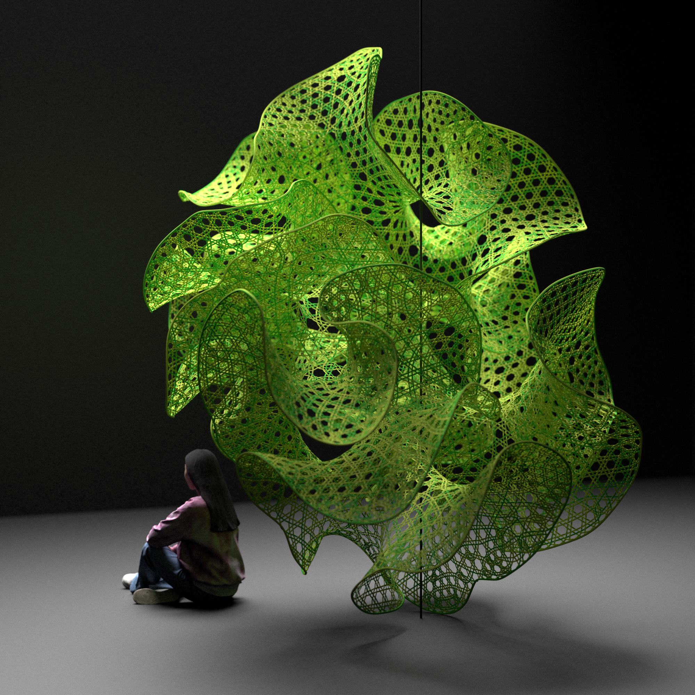
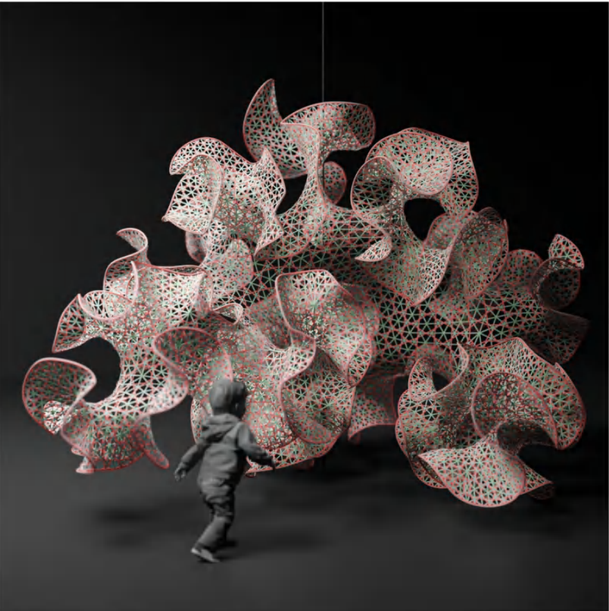
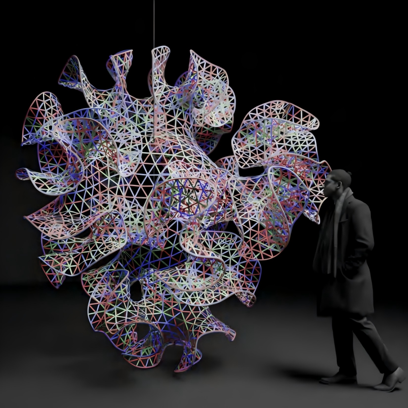

# Even Valence Remeshing

The c# implementation is based on my working paper of EVR. 

For more details about the used algorithms, see my paper:
https://hyzok-su.github.io/even-valence-remeshing/EVR.pdf

## EVR Application Example: Weaver Structure using EVR and Simulated Annealing 
(pictures rendered in VRay)

 
 
 
 

## Simulated Annealing for Interlacing Error Reduction

The weaver generation process includes:
- Pair IN points and OUT points in 1-ring neighbors of every CENTER
- Connect IN--CENTER--OUT
- MOVE CENTER points randomly along the normal direction
- Sort the orders of CENTER points by simulated annealing

 

## Dependencies

The isotropic remeshing section uses:

- Plankton (C# half-edge mesh library)
  https://github.com/meshmash/Plankton
- Mesh Machine by Daniel Piker
  https://github.com/Dan-Piker/MeshMachine

## Acknowledgements

Special thanks to the developers for providing the libraries and codes used in this project.
